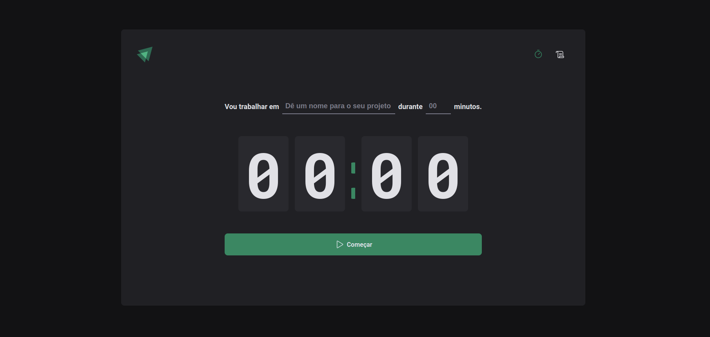

<h1 align="center">
    Timer • Projeto do 2º Módulo | Ignite Trilha ReactJS
</h1>
<br/>

## 💻 Projeto
A proposta deste projeto é entregar uma ferramenta que faz contagem de tempo para execução de tarefas.

<br/>
                
Com ela, você pode definir o nome da tarefa e o tempo que deseja dedicar a ela. Ao clicar em "Começar", o contador inicia a contagem regressiva e você pode acompanhar o tempo restante para a conclusão da tarefa.                

## 🔖 Layout

 <h1 align="center">
    
</h1>


 ## 🚀 Tecnologias

- [ReactJS](https://reactjs.org)
- [Typescript](https://www.typescriptlang.org/)

### 📡 Ferramentas Complementares

- [Styled Components](https://styled-components.com/)

<br/>

## 🤔 Como posso interagir com projeto?
- Para instalar localmente, siga os passos abaixo:

<br/>

```sh
git clone https://github.com/ManuelMolina02/02-timer-project.git
```

Após baixar o projeto, acesse o repositório via terminal e execute os seguintes comandos:

```sh
npm install 
npm run dev
```

<br/>
<br/>

Feito com 💜 por Manuel Molina 👋 Me contate através do [LinkedIn!](https://www.linkedin.com/in/manuel-angel-berger-molina-ba08b3174/)